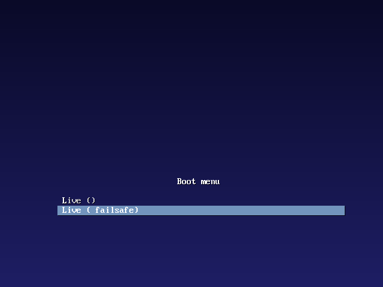
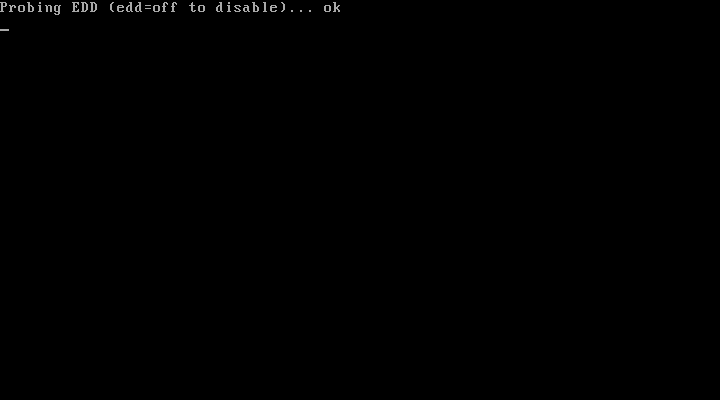
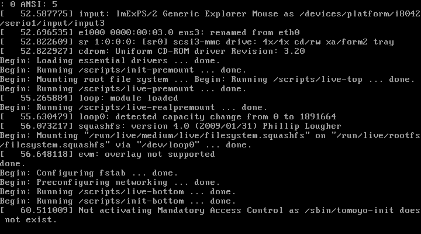
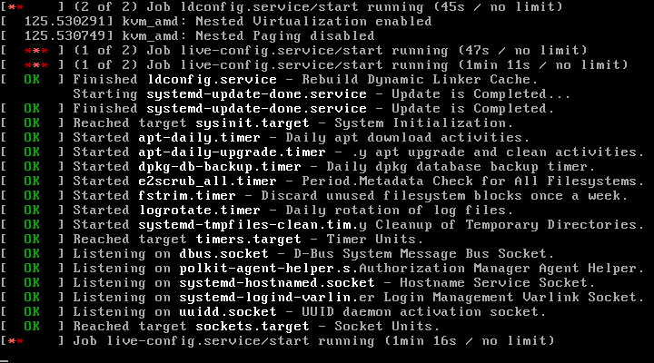
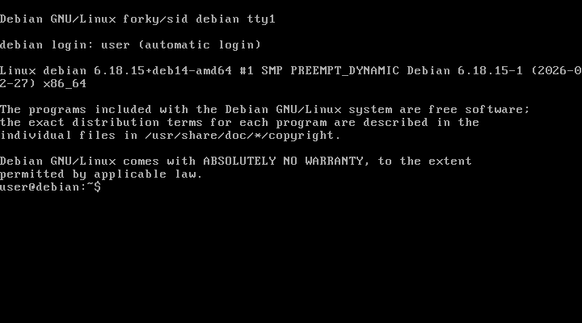

<div align="center">

# 🖥️ NakumiOS

### A Modern, Lightweight Linux Desktop Built from Scratch

*Custom Wayland compositor • Qt6 desktop environment • Dark theme with purple accents*

**Debian Testing (Trixie) • wlroots • Qt6 QML • PipeWire • C/C++20**

---

</div>

## 📸 Screenshots

### Boot Sequence

| Boot Menu | Kernel Loading | System Init |
|:---------:|:--------------:|:-----------:|
|  |  |  |
| ISOLINUX boot menu with NakumiOS branding | Linux kernel loading from live ISO | systemd services initializing |

### System Ready

| System Services | Login Ready |
|:---------------:|:-----------:|
|  |  |
| Services starting (NetworkManager, PipeWire, greetd) | Auto-login via greetd → Wayland desktop |

---

## ✨ Features

### 🪟 Custom Wayland Compositor — `nakumi-wm`

A custom compositor written in **C** using the **wlroots** library with the `wlr_scene` graph API for efficient, damage-tracked rendering.

- **6-layer scene graph** — background, bottom, tiled, floating, top, overlay
- **XDG Shell** — standard application window management
- **wlr-layer-shell** — panels, docks, launchers, and overlays
- **libinput** — keyboard, mouse, and touchpad with xkbcommon keymap
- **Focus management** — click-to-focus with automatic keyboard routing
- **Window operations** — move, resize, raise, minimize via pointer gestures

### 🔲 Desktop Panel — `nakumi-panel`

A bottom dock/taskbar using **Wayland layer-shell** protocol for proper compositor integration.

- **◆ Start button** — toggles the application launcher
- **Task manager** — shows open windows with focus switching
- **System tray** — network status, volume indicator
- **Clock** — real-time display with date tooltip
- **Session controls** — logout, shutdown, reboot via D-Bus (logind)
- **48px height** — semi-transparent dark background with purple accent highlights

### 🚀 Application Launcher — `nakumi-launcher`

A fullscreen overlay launcher with search and grid view.

- **App grid** — 140×140px cards with icons and labels
- **Real-time search** — filters by name, description, and categories
- **Desktop file parsing** — reads standard `.desktop` files from `/usr/share/applications/`
- **Keyboard navigation** — Escape to close, Tab to search, arrow keys to browse
- **Semi-transparent overlay** — dark background with blur effect

### 💻 Terminal Emulator — `nakumi-term`

A full-featured terminal with PTY support and ANSI color parsing.

- **Pseudo-terminal (PTY)** — via `forkpty()` with shell spawning
- **ANSI escape sequences** — full 16/256 color support with custom parser
- **10,000-line scrollback** — smooth scrolling history buffer
- **Non-blocking I/O** — dedicated reader thread with `poll()` loop
- **Window resize** — `SIGWINCH` handling via `ioctl(TIOCSWINSZ)`
- **Dark theme** — monospace font, `#1A1A24` background, `#E2E8F0` text

### 📁 File Manager — `nakumi-files`

A graphical file browser with navigation and mount management.

- **Directory browsing** — icons, name, size, modified date columns
- **Navigation** — back/forward history, breadcrumb path bar, home button
- **File operations** — copy, delete, create directory, refresh
- **UDisks2 integration** — D-Bus mount/unmount for removable media
- **Double-click to open** — launches files with default application
- **Status bar** — current path and item count

### ✏️ Text Editor — `nakumi-edit`

A lightweight editor with syntax highlighting and line numbers.

- **Syntax highlighting** — language detection with color coding
- **Line numbers** — custom line number area widget
- **File menu** — Open (`Ctrl+O`), Save (`Ctrl+S`), Save As (`Ctrl+Shift+S`), Quit (`Ctrl+Q`)
- **Status bar** — file path, modification state, cursor position
- **Dark theme** — consistent with desktop color palette
- **Default size** — 800×600, monospace font for editing

### ⚙️ System Settings — `nakumi-settings`

A system configuration tool with sidebar navigation.

- **📶 Wi-Fi** — NetworkManager integration via `nmcli`, scan/connect/disconnect
- **🔊 Audio** — PipeWire volume control via `wpctl`, output device selection
- **🎨 Appearance** — wallpaper picker, accent color customization
- **ℹ️ About** — CPU, memory, kernel version, hostname display
- **Persistent config** — settings saved via `QSettings`

---

## 🏗️ Architecture

```
┌──────────────────────────────────────────────────────────┐
│                    NakumiOS Desktop                       │
├────────────┬────────────┬────────────┬───────────────────┤
│   Panel    │  Launcher  │  Terminal  │   Applications    │
│ (taskbar,  │ (fullscreen│ (PTY, ANSI │ (Files, Edit,     │
│  systray,  │  app grid, │  colors,   │  Settings)        │
│  clock)    │  search)   │  scroll)   │                   │
├────────────┴────────────┴────────────┴───────────────────┤
│          nakumi-wm — Wayland Compositor (wlroots)        │
│       scene graph · xdg-shell · layer-shell · libinput   │
├──────────────────────────────────────────────────────────┤
│   Wayland  │  PipeWire  │   D-Bus    │  NetworkManager   │
│  protocols │  + Wire-   │  (UDisks2, │  (Wi-Fi, ethernet │
│            │  Plumber   │   logind)  │   management)     │
├──────────────────────────────────────────────────────────┤
│       Linux Kernel (Debian Testing / Trixie)             │
│            DRM/KMS · libinput · ALSA                     │
└──────────────────────────────────────────────────────────┘
```

---

## 🎨 Design System

NakumiOS uses a consistent dark theme across all applications.

| Token | Value | Preview |
|-------|-------|---------|
| Background | `#1A1A24` |  |
| Accent | `#6C5CE7` |  |
| Text | `#E2E8F0` |  |
| Secondary | `#A0A0B0` |  |
| Surface | `#12121A` |  |
| Hover | `#2D2D3F` |  |
| Border Radius | `12px` | — |
| Font (Body) | 13px sans-serif | — |
| Font (Code) | 14px monospace | — |

---

## 🧩 Component Overview

| Component | Language | Build | Technology | Description |
|-----------|----------|-------|------------|-------------|
| **nakumi-wm** | C | Meson | wlroots, libwayland, xkbcommon | Wayland compositor with scene graph rendering |
| **nakumi-panel** | C++20 | CMake | Qt6, wlr-layer-shell, D-Bus | Bottom dock panel with taskbar & system tray |
| **nakumi-launcher** | C++20 | CMake | Qt6 QML, QSortFilterProxyModel | Fullscreen application launcher with search |
| **nakumi-term** | C++20 | CMake | Qt6, forkpty, ANSI parser | Terminal emulator with PTY and color support |
| **nakumi-files** | C++20 | CMake | Qt6, UDisks2 D-Bus | File manager with mount support |
| **nakumi-edit** | C++20 | CMake | Qt6 Widgets | Text editor with syntax highlighting |
| **nakumi-settings** | C++20 | CMake | Qt6 QML, nmcli, wpctl | System settings (Wi-Fi, audio, appearance) |

---

## 📋 System Requirements

| Requirement | Minimum | Recommended |
|-------------|---------|-------------|
| Processor | x86_64 | x86_64 (64-bit) |
| RAM | 2 GB | 4 GB |
| Disk Space | 4 GB | 8 GB |
| GPU | DRM/KMS support | Hardware OpenGL (Mesa) |
| VM Support | ✅ Software rendering | VirtualBox, VMware, QEMU/KVM |

---

## 🔧 Build from Source

### Prerequisites

- **OS:** Debian Testing (Trixie) or Ubuntu 24.04+
- **Build tools:** `meson`, `cmake`, `ninja-build`, `pkg-config`
- **Live ISO:** `live-build`, `debian-archive-keyring`
- **Qt6:** `qt6-base-dev`, `qt6-declarative-dev`, `qt6-wayland`, `qt6-wayland-dev-tools`
- **Compositor:** `libwlroots-dev` (0.18+), `libwayland-dev`, `libxkbcommon-dev`, `libinput-dev`

### Build All Components

```bash
make build-all
```

### Build the Live ISO

```bash
# Requires root for live-build
make iso
```

### Test in QEMU

```bash
# Interactive boot (requires KVM for GPU)
make run

# Headless testing with automated screenshot capture
make test-automation
```

### Run Unit Tests

```bash
make test
```

### Create a GitHub Release

```bash
make publish
```

---

## 🖥️ VM & Hardware Support

NakumiOS includes automatic VM detection and software rendering fallback:

- **Detection:** Reads `/sys/class/dmi/id/product_name` for VirtualBox, VMware, QEMU, KVM, Bochs
- **Fallback:** `systemd-detect-virt -q` as secondary check
- **Software rendering:** Automatically exports `WLR_RENDERER=pixman`, `LIBGL_ALWAYS_SOFTWARE=1`, `WLR_NO_HARDWARE_CURSORS=1`

---

## 📦 Included Software

| Category | Packages |
|----------|----------|
| **Kernel** | `linux-image-amd64`, `firmware-linux-free` |
| **Init** | `systemd`, `systemd-sysv` |
| **Live System** | `live-boot`, `live-config` |
| **Graphics** | `libgl1-mesa-dri`, `mesa-utils`, `xwayland`, `libdrm2`, `libgbm1` |
| **Audio** | `pipewire`, `wireplumber` |
| **Network** | `network-manager` |
| **Login** | `greetd` (auto-login to desktop) |
| **Desktop** | `qt6-wayland`, `qml6-module-qtquick-controls`, `qml6-module-qtquick-layouts` |
| **Fonts** | `fonts-noto` |
| **Icons** | `papirus-icon-theme` |
| **Tools** | `grim` (screenshot), `slurp` (region select), `curl`, `jq` |

---

## 📄 License

MIT License — See [LICENSE](LICENSE) for details.
